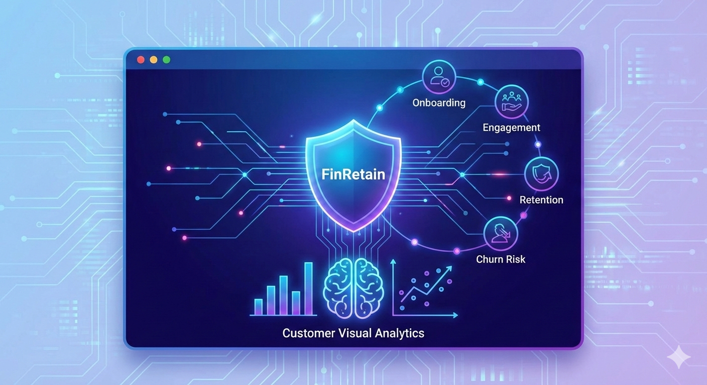

::::: {.grid .hero-section align-items="center"}
::: {.g-col-12 .g-col-md-6 .hero-text}
# Democratising FinTech Data through Visual Analytics

### An interactive exploration of Customer Retention, Behavioral Clustering, and Macro Ecosystem Flow.

Our project, **FinRetain**, leverages Exploratory Data Analysis, K-Means Clustering, and Predictive Modelling to transform static transactional data into actionable business intelligence. Built for **ISSS608 Visual Analytics**.

[View Project Proposal](proposal.qmd){.btn .btn-outline-primary .btn-lg role="button"}

[Launch Interactive Dashboard](https://your-username.shinyapps.io/finretain){.btn .btn-primary .btn-lg role="button" target="_blank"}
:::

::: {.g-col-12 .g-col-md-6 style="display: flex; flex-direction: column; gap: 2rem;"}
{style="border-radius: 8px; box-shadow: 0 4px 12px rgba(0,0,0,0.15);"}

{style="border-radius: 8px; box-shadow: 0 4px 12px rgba(0,0,0,0.15);"}
:::
:::::

:::::: {.grid .text-center .py-5}
::: {.g-col-12 .g-col-md-4 .feature-box}
## 📊 EDA & CDA

Rigorous data preparation to establish demographic baselines and confirm behavioral hypotheses using interactive visualization.
:::

::: {.g-col-12 .g-col-md-4 .feature-box}
## 🧠 Clustering & Modelling

Deploying K-Means algorithms to segment users, paired with Kaplan-Meier Survival Models and Sankey Networks to trace capital flow.
:::

::: {.g-col-12 .g-col-md-4 .feature-box}
## 🔮 Predictive Simulation

An interactive Risk Simulator powered by regression models, allowing stakeholders to dynamically forecast Churn Probability and CLV.
:::
::::::
