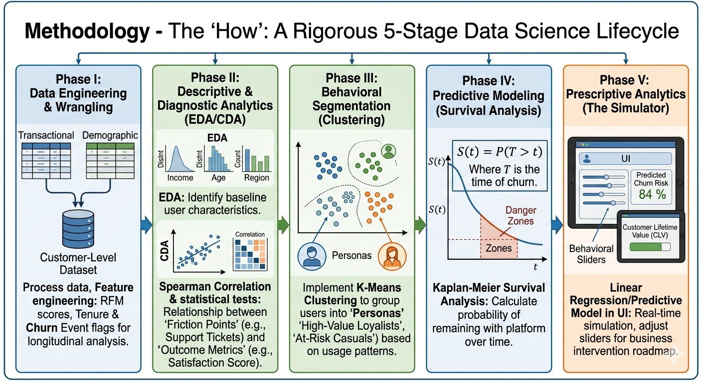
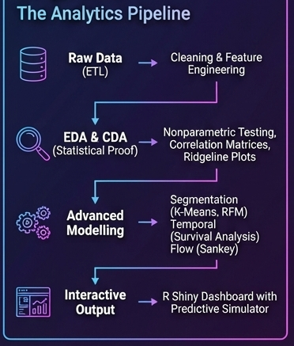

## Introduction

In the highly competitive financial technology (FinTech) and banking sector, customer retention is a critical driver of profitability. Acquiring a new customer is significantly more expensive than retaining an existing one. However, identifying exactly *when* and *why* a customer might abandon a financial platform (churn) remains a complex challenge due to the high-dimensional nature of transactional data.

**FinRetain** is designed to address this critical blind spot. It is an interactive visual analytics platform built to help financial analysts and product stakeholders dynamically explore customer demographics, track behavioral friction points, and proactively predict churn using advanced statistical modeling.

## Motivation - The "Why"

The motivation for **FinRetain** stems from the "Churn Blindness" often faced by growing FinTech platforms. While transaction volumes are high, user loyalty is fragile.

-   **The Proactive Gap:** Most financial dashboards are descriptive—they show who has already left. FinRetain was created to move the needle toward predictive and prescriptive analytics, allowing managers to intervene before the customer walks away.

-   **The 90-Day Cliff:** Preliminary data suggests a critical drop-off in user retention within the first three months. Our motivation is to pinpoint exactly why this "cliff" exists and which specific user behaviors (like high support ticket counts or low engagement) trigger it.

-   **Actionable Intelligence:** We aim to bridge the gap between complex data science models and non-technical decision-makers. By turning abstract statistical correlations into a "What-If" simulator, we empower managers to see the immediate ROI of improving customer satisfaction.

## Methodology - The "How"

Our methodology follows a rigorous 5-stage Data Science Lifecycle, ensuring that every visual in the app is backed by mathematical validity.

**Phase I: Data Engineering & Wrangling**

We processed raw transactional and demographic data into a consolidated customer-level dataset. This involved:

-   Feature engineering for RFM (Recency, Frequency, Monetary) scores.

-   Calculating "Tenure" and "Churn Event" flags for longitudinal analysis.

**Phase II: Descriptive & Diagnostic Analytics (EDA/CDA)**

-   EDA: We use distribution plots to identify baseline user characteristics (Income, Age, Region).

-   CDA: We apply Spearman Correlation and statistical tests to prove the relationship between "Friction Points" (e.g., Support Tickets) and "Outcome Metrics" (e.g., Satisfaction Score).

**Phase III: Behavioral Segmentation (Clustering)**

To move beyond generic averages, we implemented K-Means Clustering. This allows the tool to automatically group users into distinct "Personas" (like "High-Value Loyalists" vs. "At-Risk Casuals") based on their actual usage patterns.

**Phase IV: Predictive Modeling (Survival Analysis)**

We employ Kaplan-Meier Survival Analysis to calculate the probability of a customer remaining with the platform over time. The survival function is defined as:

{width="196" height="40"}

Where $T$ is the time of churn. This identifies the specific "danger zones" in the customer lifecycle.

**Phase V: Prescriptive Analytics (The Simulator)**

The final stage of our methodology involves a Linear Regression/Predictive Model integrated into a UI. This allows for real-time simulation: by adjusting behavioral sliders, the app calculates a predicted Churn Risk % and Customer Lifetime Value (CLV), providing a direct roadmap for business intervention.

## Prototype Sketches of the Proposed UI

## Project Objectives

Our primary goal is to build an interactive R Shiny application that transforms raw transactional and demographic data into actionable business intelligence. Specifically, this project aims to transition from descriptive reporting to proactive forecasting through:

1.  **Behavioral Exploration:** Provide interactive visual tools to understand user demographic profiles and identify friction points in the user experience.

2.  **Algorithmic Profiling (K-Means):** Autonomously group users into distinct behavioral personas based on transaction frequency and monetary volume.

3.  **Advanced Segmentation (RFM):** Classify the customer base into actionable business segments based on Recency, Frequency, and Monetary metrics.

4.  **Time-to-Event Analysis:** Utilize Survival Analysis to determine the exact tenure timeline where specific customer groups are at the highest risk of dropping off.

5.  **Macro Cash Flow Mapping:** Visualize the holistic ecosystem of liquidity entering and exiting the platform.

6.  **Predictive Risk Assessment:** Implement a dynamic simulator to forecast churn probability and estimate Customer Lifetime Value (CLV) based on adjustable inputs.

## Data Description

Our data preparation pipeline cleans raw demographic and transactional data from **COFINFAD: Colombian Fintech Financial Analytics Dataset.** The dataset powering FinRetain contains historical records of customer accounts and transactional logs, encompassing:

-   **Demographics:** Age, Gender, Education Level, Income Bracket.
-   **Engagement Metrics:** App Logins, Support Tickets Logged, Satisfaction Score (1-5).
-   **Transactional Data:** Transaction counts, average transaction values, and aggregated volumes across various types (Deposits, Payments, Transfers, Withdrawals).
-   **Target Variables:** Customer Tenure (months), Churn Probability, and Customer Lifetime Value (CLV).

## Interactive Analytical Modules

To transition from static reporting to proactive forecasting, FinRetain is segmented into six distinct interactive modules:

### 1. Exploratory Data Analysis (EDA)

Using `ggplot2` and `plotly`, this module allows stakeholders to interactively explore the demographic shape of the user base. Users will utilize sidebar dropdowns (`selectInput`) to dynamically filter charts by Gender and Customer Segments, allowing them to isolate and investigate specific high-value demographics.

### 2. Confirmatory Data Analysis (CDA)

Analysts will use this module to investigate statistical hypotheses. Users can dynamically facet statistical scatter plots (`ggstatsplot`) by different demographic parameters (e.g., Income vs. Education) to drill down into the negative correlation between Support Tickets and overall App Satisfaction for specific user subsets.

### 3. Customer Segmentation (K-Means & RFM)

Moving beyond basic demographics, this module empowers users to explore algorithmic personas. Interactive Plotly scatter plots and RFM Treemaps will allow analysts to hover over individual data points to view specific user risk metrics, visually revealing the difference in value between "High-Volume" and "High-Frequency" customer clusters.

### 4. Time-to-Event Survival Analysis

Using the `survival` and `survminer` packages, this module acts as a dynamic "ticking clock." Instead of viewing a static chart, users will select different grouping parameters from the UI to instantly recalculate and redraw Kaplan-Meier Churn Probability Curves. This allows the analyst to actively hunt for the specific demographics suffering the worst 90-day drop-off rates.

### 5. Ecosystem Cash Flow (Sankey Diagram)

Using the `networkD3` library, this interactive module maps the directional flow of capital. Users can trace how external funds pool into the app wallet and disperse into out-flows, visually investigating liquidity bottlenecks.

### 6. Predictive Risk Simulator

The pinnacle of the app's prescriptive analytics. Powered by Multiple Linear Regression models (`lm`), this interactive sandbox features multiple `sliderInput` controls. Managers can adjust a hypothetical customer's parameters (Age, Transaction Count, Support Tickets) to observe real-time, simulated shifts in predicted Churn Probability and Customer Lifetime Value (CLV).

## Proposed UI Architecture & Shiny Components

To build a highly interactive visual analytics tool, **FinRetain** will utilize the `shiny` framework combined with `bslib` for a modern, responsive layout.

**1. Application Layout (bslib):**

-   **`page_navbar()`:** Will be used as the top-level navigation, allowing analysts to switch between analytical modules (EDA, Clustering, Survival, Simulator).

-   **`page_sidebar()` & `sidebar()`:** Will be implemented within each tab to house the interactive control panels on the left side of the screen, ensuring parameters are always visible.

-   **`card()` & `card_header()`:** Will be used in the main panel to neatly organize multiple plots and key performance indicators (KPIs) into distinct, elevated containers.

**2. Interactive Input Components (Widgets):**

-   **`selectInput()` / `radioButtons()`:** To allow analysts to dynamically select grouping variables (e.g., changing the Survival Curve from "Income Bracket" to "Acquisition Channel").

-   **`sliderInput()` / `numericInput()`:** For the Predictive Risk Simulator, allowing managers to adjust quantitative behaviors (e.g., reducing support tickets from 5 to 2) to see real-time changes in predicted churn.

-   **`dateRangeInput()`:** To filter transactional data by specific timeframes.

**3. Dynamic Output Components:**

-   **`plotlyOutput()` / `renderPlotly()`:** We will wrap our `ggplot2` charts in `plotly` to support deep analysis via tooltips (hover information), zooming, and panning.

-   **`plotOutput()` / `renderPlot()`:** Used for specialized statistical plots (like `ggsurvplot` and `ggcorrplot`).

-   **`DTOutput()` / `renderDT()`:** To display interactive, searchable data tables of "At-Risk Customers" that dynamically update based on the visual selections made above them.

## Proposed Deliverables

1.  **R Shiny Application:** A fully deployed, interactive web application hosted on shinyapps.io featuring a low-cognitive-load UI designed with `bslib`.
2.  **Project Report/Website:** A comprehensive Quarto document detailing the technical architecture, methodology, business findings, and user guide.
3.  **Source Code Repository:** A clean, well-commented GitHub repository containing the ETL data pipeline (`app_data.rds`) and application logic (`app.R`).

## Project Timeline

| Phase | Task | Expected Completion |
|:--:|:---|:---|
| 1 | Data Extraction, ETL Pipeline & Feature Engineering | 21/02/2026 |
| 2 | Core UI/UX Dashboard Layout Design | 25/02/2026 |
| 3 | Implementation of EDA, CDA & Clustering Modules | 01/03/2026 |
| 4 | Advanced Analytics Integration (Survival, RFM, Sankey) | 15/03/2026 |
| 5 | Predictive Simulator Implementation & Final Testing | 29/03/2026 |
| 6 | Final Quarto Report Submission & ShinyApps Deployment | 04/04/2026 |

::: callout-tip
For more specific timeline details, please refer to the section of **Minutes of Meeting - Project Gantt Chart** and the followings.
:::
