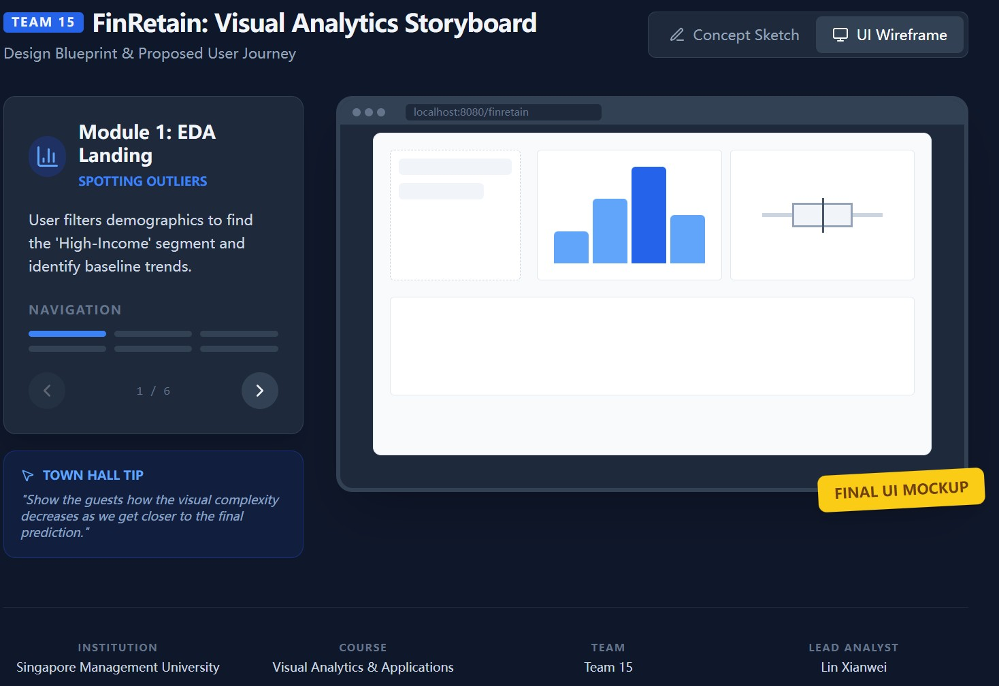
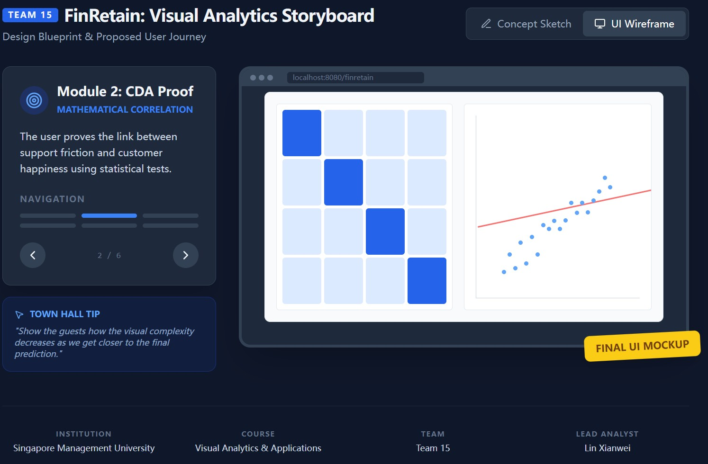
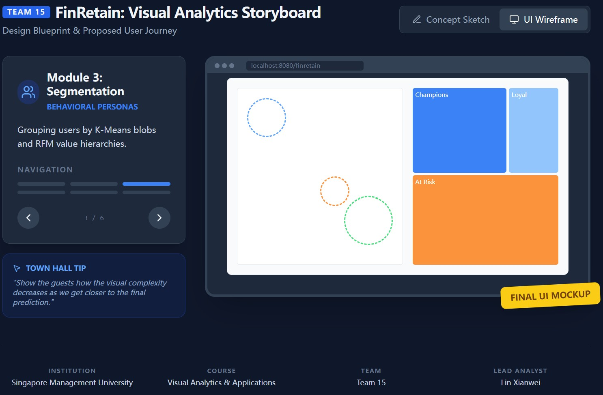
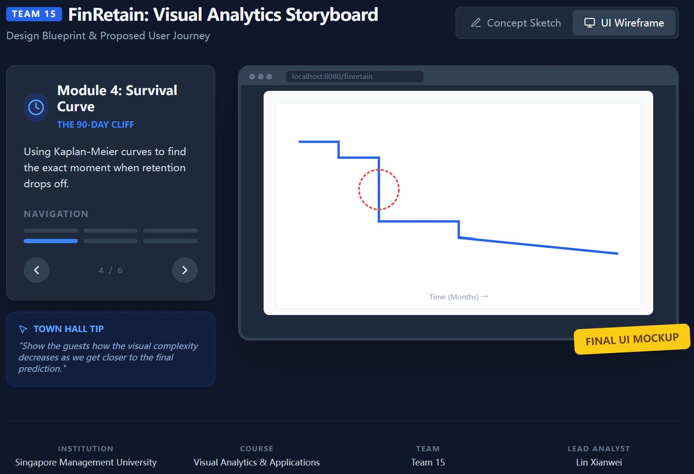
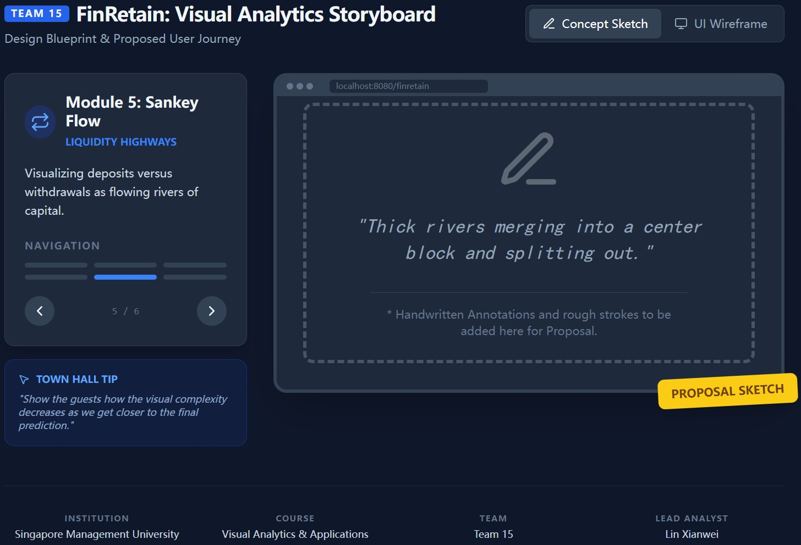
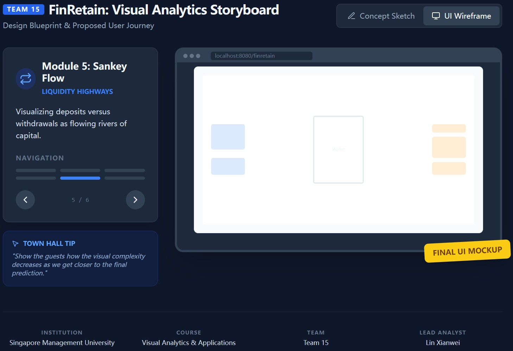
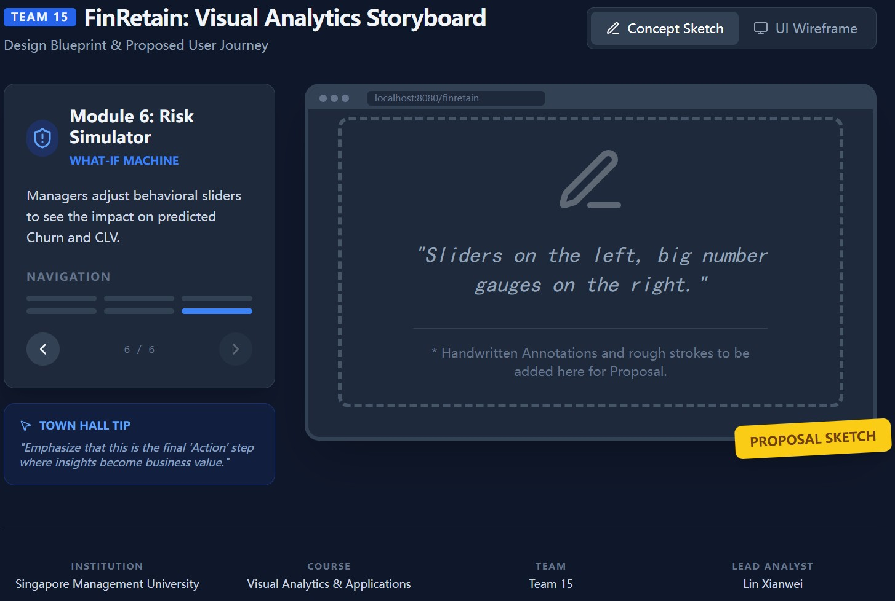
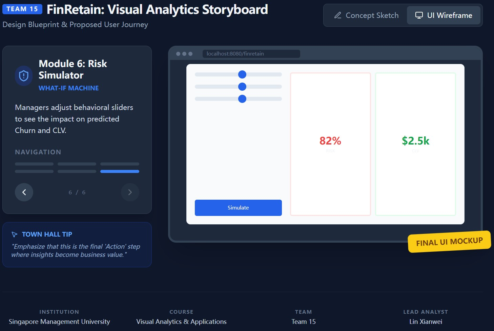

# The FinRetain Narrative

Data without a narrative is just noise. Our storyboard maps out the complete journey of a FinTech customer—from their first deposit to their potential departure—and demonstrates how our Visual Analytics dashboard empowers stakeholders to intervene at the right moments.

## Section 1

## Section 2

## Section 3

## Section 4

## Section 5

## Section 6

# Conclusion

The FinRetain dashboard proves that Visual Analytics is more than just plotting charts; it is about building a decision-making engine. By combining exploratory data analysis, algorithmic clustering, and predictive forecasting into a single, cohesive storyboard, we empower FinTech platforms to protect their most valuable asset: their users.
