## The FinRetain Narrative

Data without a narrative is just noise. Our storyboard maps out the complete journey of a FinTech customer—from their first deposit to their potential departure—and demonstrates how our Visual Analytics dashboard empowers stakeholders to intervene at the right moments.

## Motivation - The "Why"

The motivation for **FinRetain** stems from the "Churn Blindness" often faced by growing FinTech platforms. While transaction volumes are high, user loyalty is fragile.

-   **The Proactive Gap:** Most financial dashboards are descriptive—they show who has already left. FinRetain was created to move the needle toward predictive and prescriptive analytics, allowing managers to intervene before the customer walks away.

-   **The 90-Day Cliff:** Preliminary data suggests a critical drop-off in user retention within the first three months. Our motivation is to pinpoint exactly why this "cliff" exists and which specific user behaviors (like high support ticket counts or low engagement) trigger it.

-   **Actionable Intelligence:** We aim to bridge the gap between complex data science models and non-technical decision-makers. By turning abstract statistical correlations into a "What-If" simulator, we empower managers to see the immediate ROI of improving customer satisfaction.

## Methodology: The "How"

Our methodology follows a rigorous 5-stage Data Science Lifecycle, ensuring that every visual in the app is backed by mathematical validity.

**Phase I: Data Engineering & Wrangling**

We processed raw transactional and demographic data into a consolidated customer-level dataset. This involved:

-   Feature engineering for RFM (Recency, Frequency, Monetary) scores.

-   Calculating "Tenure" and "Churn Event" flags for longitudinal analysis.

**Phase II: Descriptive & Diagnostic Analytics (EDA/CDA)**

-   EDA: We use distribution plots to identify baseline user characteristics (Income, Age, Region).

-   CDA: We apply Spearman Correlation and statistical tests to prove the relationship between "Friction Points" (e.g., Support Tickets) and "Outcome Metrics" (e.g., Satisfaction Score).

**Phase III: Behavioral Segmentation (Clustering)**

To move beyond generic averages, we implemented K-Means Clustering. This allows the tool to automatically group users into distinct "Personas" (like "High-Value Loyalists" vs. "At-Risk Casuals") based on their actual usage patterns.

**Phase IV: Predictive Modeling (Survival Analysis)**

We employ Kaplan-Meier Survival Analysis to calculate the probability of a customer remaining with the platform over time. The survival function is defined as:

{width="196" height="40"}

Where $T$ is the time of churn. This identifies the specific "danger zones" in the customer lifecycle.

**Phase V: Prescriptive Analytics (The Simulator)**

The final stage of our methodology involves a Linear Regression/Predictive Model integrated into a UI. This allows for real-time simulation: by adjusting behavioral sliders, the app calculates a predicted Churn Risk % and Customer Lifetime Value (CLV), providing a direct roadmap for business intervention.

## The Storyboard

### Overview: The Navigation Menu

The FinRetain app is divided into distinct analytical modules, accessible via the top navigation bar. Move sequentially from left to right to follow our data science pipeline, or jump directly to the predictive simulator if you want to test interventions.

1.  **Exploratory Data (EDA):** Understand the demographic shape and tenure of the customer base.
2.  **Confirmatory Data (CDA):** View mathematical correlations and statistical proofs.
3.  **Customer Segmentation:** Explore algorithmic (K-Means) and rule-based (RFM) customer groups.
4.  **Survival Timeline:** Track the exact months where churn risk spikes.
5.  **Ecosystem Cash Flow:** Trace macro-liquidity through the platform.
6.  **Predictive Risk Simulator:** Use machine learning to forecast a specific user's future value.

------------------------------------------------------------------------

### Module 1: Exploratory Data (EDA)

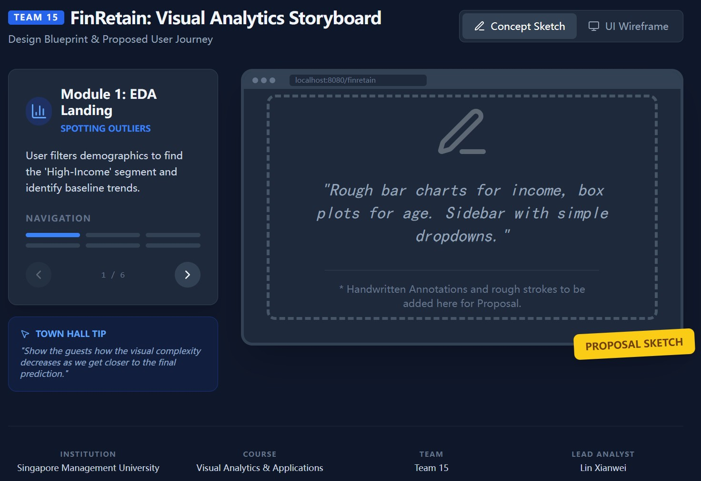

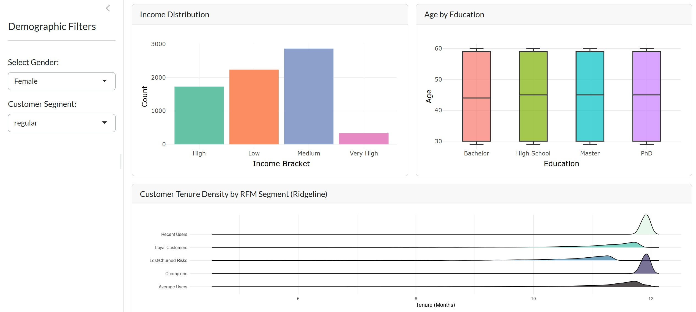

This tab allows you to view the foundational demographics of our user base.

-   **Step 1:** Use the sidebar on the left to filter the entire dashboard by **Gender** or **Customer Segment**.
-   **Step 2:** Observe how the "Income Distribution" bar chart and "Age by Education" box plots dynamically update.
-   **Step 3:** Review the Ridgeline plot at the bottom to see how customer tenure density varies across different RFM segments.

> **💡 Try this!** Filter the Customer Segment to "Premium" and see how the density of their tenure shifts compared to the "Standard" segment.

------------------------------------------------------------------------

## Module 2: Confirmatory Data (CDA)

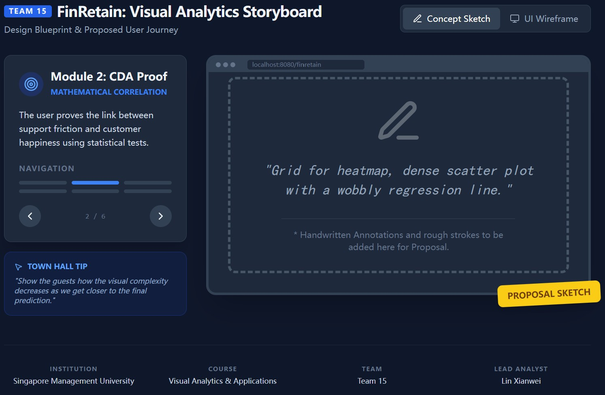

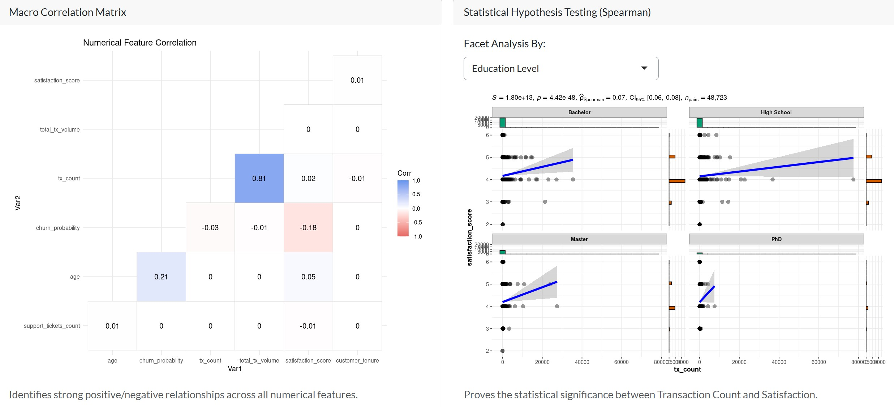

Move beyond visual assumptions and interact with our statistical models.

-   **Macro Correlation Matrix:** This heatmap identifies strong positive (blue) or negative (red) relationships across all numerical features.
-   **Hypothesis Testing:** Use the dropdown menu to facet the `ggscatterstats` plot by either *Income Bracket* or *Education Level*. This proves the statistical significance of the relationship between Transaction Count and Satisfaction.

------------------------------------------------------------------------

## Module 3: Customer Segmentation

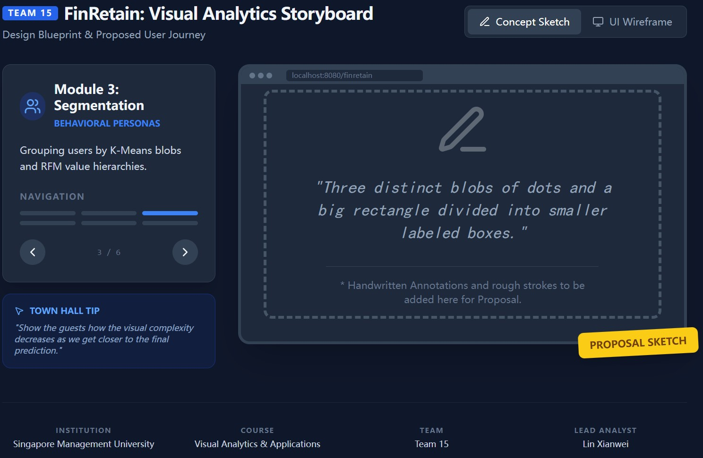

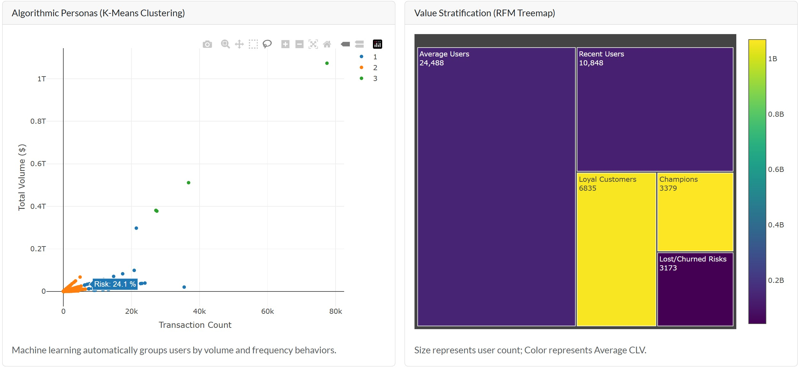

This module groups users using two distinct methodologies: Machine Learning and Value Stratification.

-   **Algorithmic Personas (K-Means):** Hover over the scatter plot to see how our unsupervised machine learning algorithm automatically grouped users into three behavioral clusters based purely on transaction volume and count.
-   **Value Stratification (RFM Treemap):** This chart categorizes the database into actionable blocks (e.g., "Champions", "Recent Users").
    -   **Size** = Number of users in that segment.
    -   **Color** = The Average Customer Lifetime Value (CLV).

> **💡 Try this!** Hover over the smallest boxes in the Treemap. Notice how some visually small segments actually possess the darkest colors, indicating highly concentrated wealth.

------------------------------------------------------------------------

## Module 4: Survival Timeline

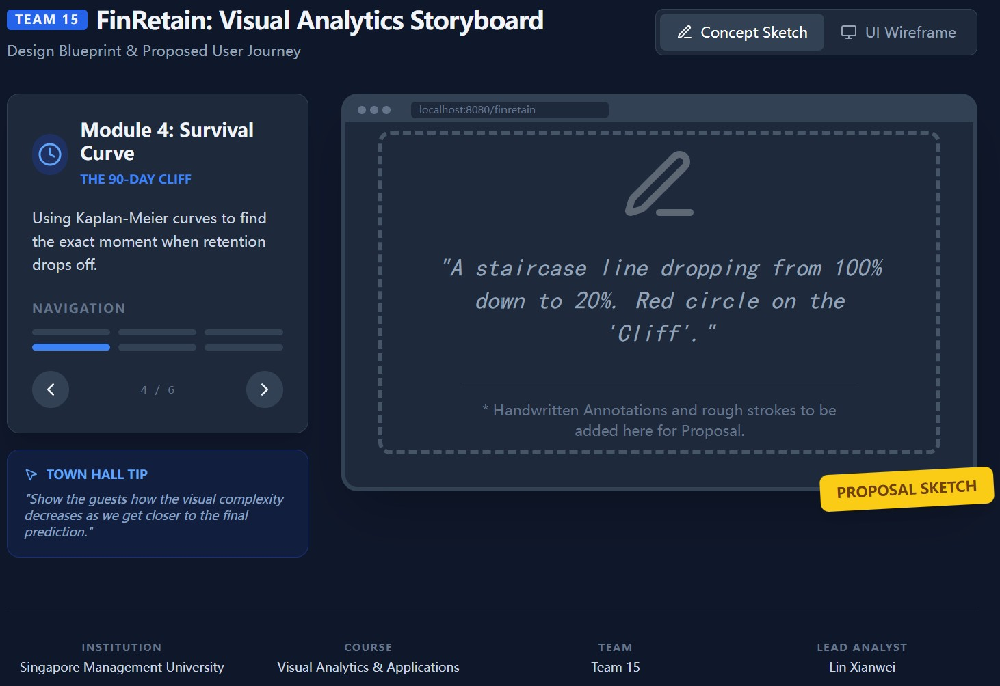

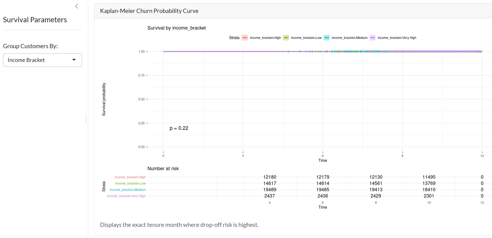

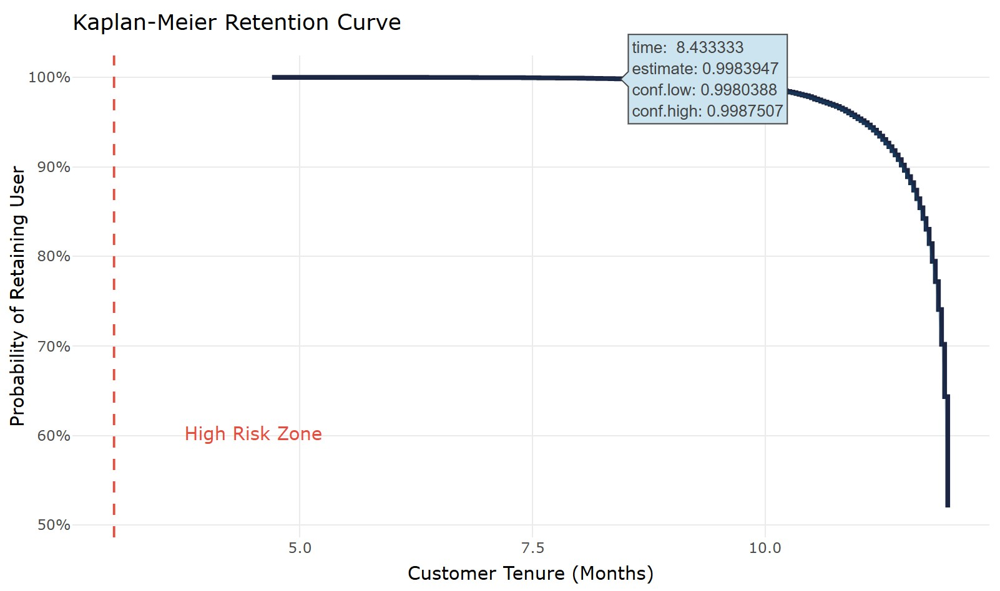

This module answers the critical question: *When do users leave?*

-   **Step 1:** Go to the "Survival Parameters" sidebar.
-   **Step 2:** Select a variable to group the customers by (Acquisition Channel, Income Bracket, or Customer Segment).
-   **Step 3:** The Kaplan-Meier curve will generate a timeline. Look for the steepest drops in the line—this indicates the exact tenure month where drop-off risk is highest.

------------------------------------------------------------------------

## Module 5: Ecosystem Cash Flow

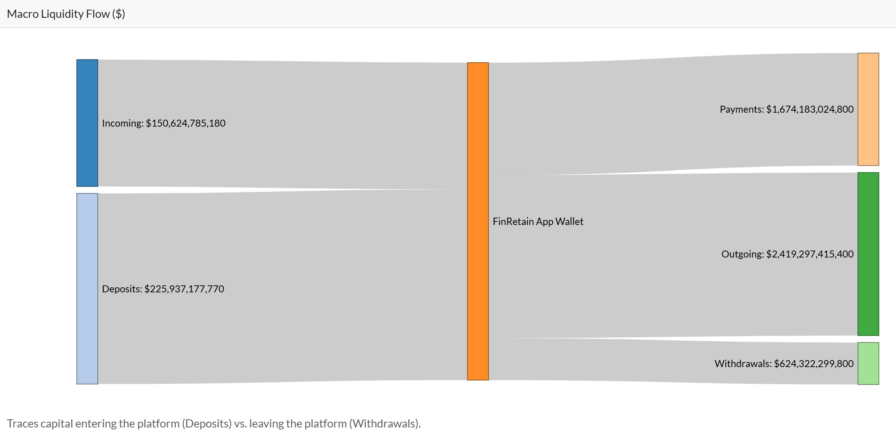

A macro-view of the platform's liquidity.

-   **Visualizing the Flow:** This Sankey network traces capital from the moment it enters the platform (Incoming Transfers, Direct Deposits) to the moment it leaves (App Payments, Outgoing Transfers, Cash Withdrawals).
-   **Interaction:** You can click and drag the nodes (the vertical bars) to rearrange the network for a clearer view of specific money pipelines.

------------------------------------------------------------------------

## Module 6: Predictive Risk Simulator

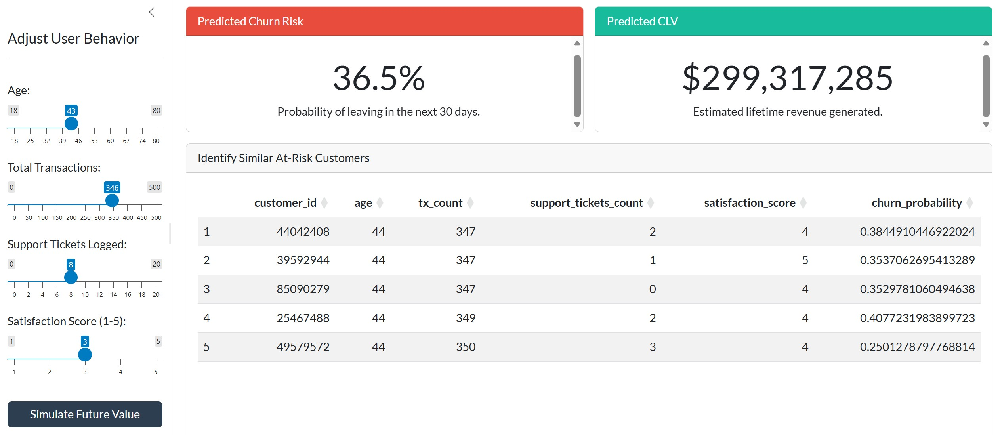

This is the most powerful tool in the application, allowing you to simulate interventions to save at-risk customers.

-   **Step 1:** Use the sliders on the left to build a custom user profile (adjusting Age, Total Transactions, Support Tickets, and Satisfaction Score).
-   **Step 2:** Click the **"Simulate Future Value"** button.
-   **Step 3:** The dashboard will use our Multiple Linear Regression models to instantly predict this user's **Churn Risk** (Probability of leaving in 30 days) and **Predicted CLV** (Estimated lifetime revenue).
-   **Step 4:** Scroll down to the Data Table to instantly view the top 5 real customers in the database who most closely match the exact profile you just simulated.

> **💡 Try this!** Set the "Support Tickets Logged" slider to 0 and hit simulate. Then, slide it up to 15 and hit simulate again. Watch how drastically the red "Predicted Churn Risk" box spikes!

### 

## Conclusion

The FinRetain dashboard proves that Visual Analytics is more than just plotting charts; it is about building a decision-making engine. By combining exploratory data analysis, algorithmic clustering, and predictive forecasting into a single, cohesive storyboard, we empower FinTech platforms to protect their most valuable asset: their users.
